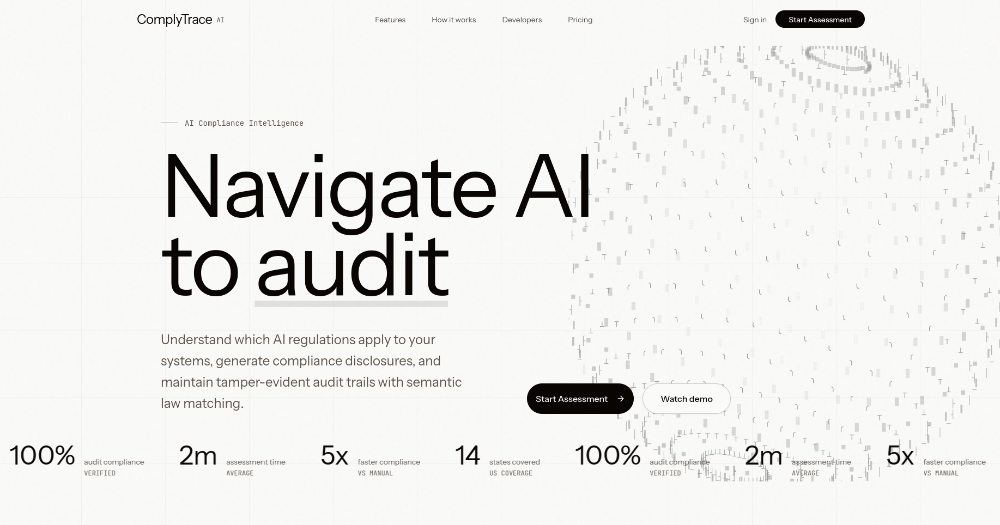
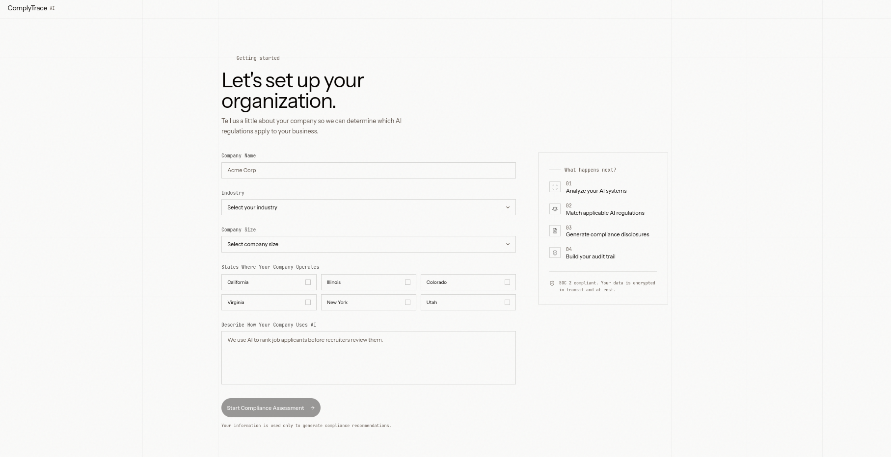
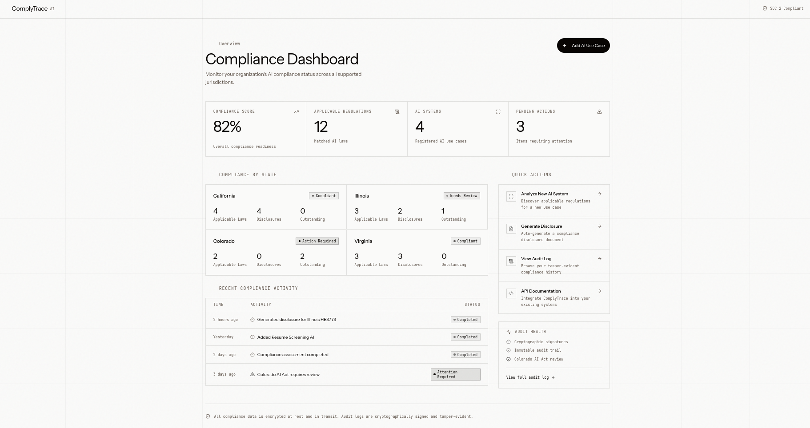
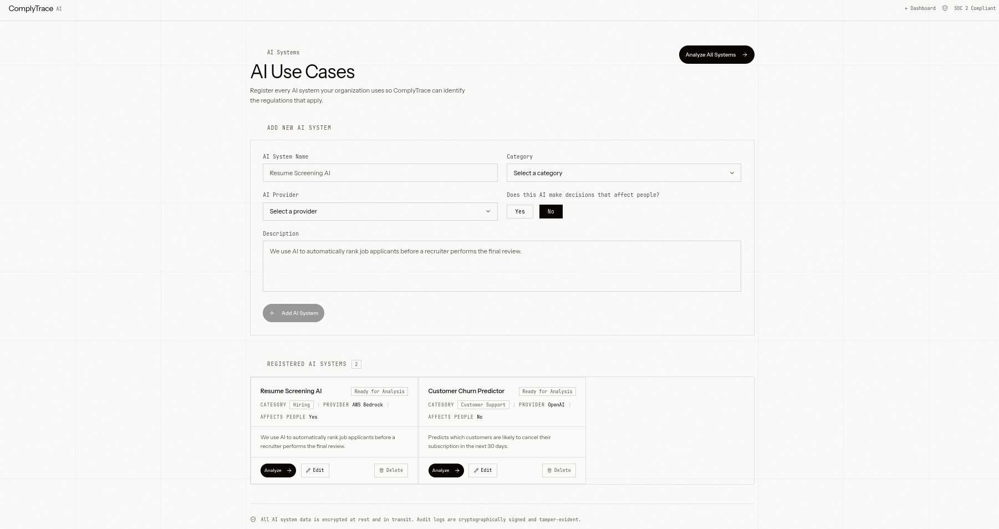
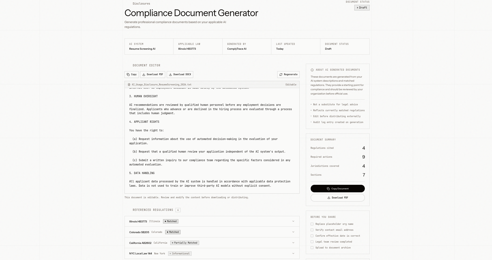
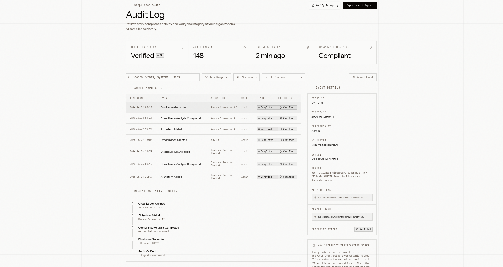
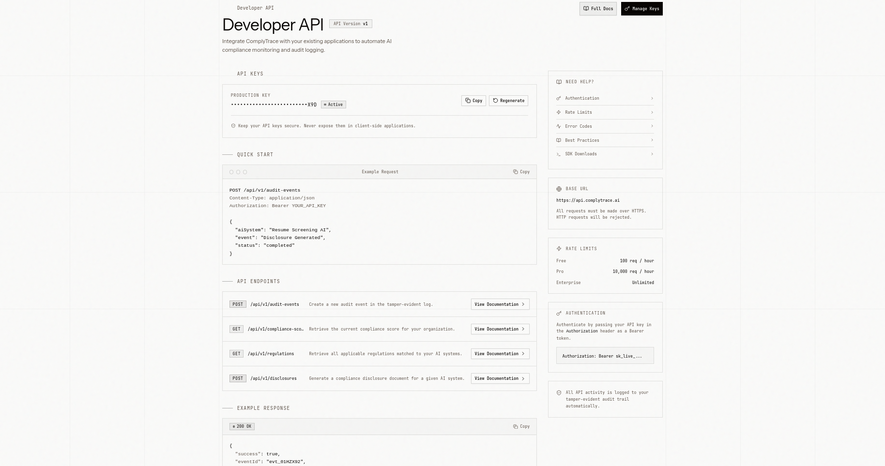

<p align="center">
  
</p>

<h1 align="center">ComplyTrace</h1>

<p align="center">
  <strong>AI-Powered Compliance for AI-Powered Companies</strong><br/>
  Automatically match your AI systems to applicable state regulations, generate disclosure documents, and maintain a tamper-evident audit trail.
</p>

<p align="center">
  
  
  
  
  
</p>

---

## The Problem

AI regulation is accelerating. States like California, Illinois, Colorado, Virginia, New York, and Utah have each passed distinct laws governing how companies can use AI — particularly in hiring, customer decisions, and automated profiling.

For companies deploying AI, this creates a compliance nightmare:

- **Which laws apply to me?** Each state has different rules, thresholds, and definitions.
- **What do I need to disclose?** Notification requirements vary by jurisdiction and AI use case.
- **Can I prove compliance?** Regulators and auditors want evidence, not just claims.
- **How do I keep up?** New laws pass every legislative session.

Most companies either ignore the problem (risky) or hire expensive legal teams to manually track regulations (slow and doesn't scale).

## The Solution

ComplyTrace uses **Retrieval-Augmented Generation (RAG)** to automatically match your AI systems against a corpus of real AI laws, generate jurisdiction-specific compliance disclosures, and maintain a cryptographically-signed audit trail that proves every compliance action taken.

---

## How It Works

### 1. Onboarding — Tell Us About Your Organization

<p align="center">
  
</p>

Register your company, select your operating states, and describe your AI systems. ComplyTrace uses this information to determine which regulations apply to you.

---

### 2. Compliance Dashboard — See Your Status at a Glance

<p align="center">
  
</p>

A real-time dashboard showing:
- **Compliance Score** — percentage of applicable regulations addressed
- **Per-State Breakdown** — which states need attention (red/yellow/green)
- **Pending Actions** — systems awaiting analysis or states needing disclosures
- **Audit Health** — cryptographic integrity status of your compliance trail

---

### 3. AI System Analysis — RAG-Powered Law Matching

<p align="center">
  
</p>

Each AI system you register gets analyzed against our law corpus using semantic vector search:
1. Your AI system description is embedded into a 1024-dim vector
2. Cosine similarity search finds the most relevant law sections across your operating states
3. An AI explanation is generated for each match, grounding it in the actual law text

---

### 4. Disclosure Generation — Grounded in Real Law

<p align="center">
  
</p>

Generate compliance disclosure documents that cite the actual law passages they're based on. Every disclosure includes:
- Source citation and provenance tracking
- Placeholder markers for org-specific details
- A mandatory "not legal advice" disclaimer baked into the API response

---

### 5. Tamper-Evident Audit Log

<p align="center">
  
</p>

Every compliance action is recorded in a hash-chained audit log:
- Each entry contains `sha256(prev_hash + canonical_payload)`
- Chain integrity is verifiable at any time
- Database-level `REVOKE UPDATE, DELETE` prevents tampering
- Public API endpoint for external systems to log their own AI decisions

---

### 6. Developer API — Integrate Into Your Stack

<p align="center">
  
</p>

A REST API with `x-api-key` authentication lets your existing systems log AI decisions directly into ComplyTrace's tamper-evident audit trail.

---

## Architecture

```
┌─────────────────────────────────────────────────────────────┐
│  Frontend (Next.js 16 · React 19 · Tailwind · shadcn/ui)    │
│  Port 3000                                                   │
└──────────────────────────┬──────────────────────────────────┘
                           │ HTTP (CORS)
┌──────────────────────────▼──────────────────────────────────┐
│  Backend API (Next.js 15 · Route Handlers)                   │
│  Port 3001                                                   │
│                                                              │
│  ┌──────────┐  ┌──────────┐  ┌───────────────┐             │
│  │ AI Seam  │  │ Hash Lib │  │ Drizzle ORM   │             │
│  │ embed()  │  │ logDecn()│  │ schema + pool  │             │
│  │ genText()│  │ verify() │  │               │             │
│  └──────────┘  └──────────┘  └───────┬───────┘             │
└───────────────────────────────────────┼─────────────────────┘
                                        │
┌───────────────────────────────────────▼─────────────────────┐
│  PostgreSQL 16 + pgvector (Docker)                           │
│                                                              │
│  • organizations        • law_chunks (vector 1024 + HNSW)   │
│  • users                • matched_rules                      │
│  • jurisdictions        • disclosures                        │
│  • business_ai_cases    • ai_decision_log (append-only)      │
└─────────────────────────────────────────────────────────────┘
```

## Tech Stack

| Layer | Technology |
|-------|-----------|
| Frontend | Next.js 16, React 19, Tailwind CSS 4, shadcn/ui, Recharts |
| Backend | Next.js 15 Route Handlers, Zod validation, CORS middleware |
| Database | PostgreSQL 16 + pgvector (HNSW indexes) |
| ORM | Drizzle ORM |
| AI / Embeddings | @xenova/transformers (all-MiniLM-L6-v2), zero-padded to 1024-dim |
| Text Generation | Anthropic Claude (with template fallback when no key) |
| Audit Chain | SHA-256 hash chain with DB-level append-only enforcement |
| Infrastructure | Docker Compose |

## Quick Start

### Prerequisites

- Node.js 18+
- pnpm
- Docker & Docker Compose

### 1. Start the database

```bash
cd backend
docker compose up -d
```

### 2. Set up the backend

```bash
cd backend
pnpm install
pnpm setup-extensions    # Enable pgvector + pgcrypto
pnpm db:push             # Create all tables
pnpm post-migrate        # Add HNSW vector indexes
pnpm ingest              # Load 6 state law corpora with embeddings
pnpm dev                 # Start API on :3001
```

### 3. Start the frontend

```bash
cd frontend
pnpm install
pnpm dev                 # Start UI on :3000
```

### 4. Use it

1. Visit `http://localhost:3000`
2. Click "Get Started" → complete onboarding
3. Your AI systems will appear on the Use Cases page — click "Analyze"
4. View matched regulations on the Dashboard
5. Generate disclosures and inspect the audit log

## API Endpoints

| Method | Endpoint | Description |
|--------|----------|-------------|
| `GET` | `/api/health` | Database health check |
| `POST` | `/api/organizations` | Create organization + admin user |
| `GET` | `/api/organizations/:id` | Get organization details |
| `POST` | `/api/ai-systems` | Register an AI system |
| `GET` | `/api/ai-systems?orgId=` | List AI systems for org |
| `PATCH` | `/api/ai-systems/:id` | Update AI system |
| `DELETE` | `/api/ai-systems/:id` | Delete AI system |
| `POST` | `/api/ai-systems/:id/analyze` | Run RAG analysis |
| `POST` | `/api/ai-systems/analyze-all` | Batch analyze all pending |
| `GET` | `/api/dashboard?orgId=` | Aggregated compliance data |
| `POST` | `/api/disclosures` | Generate disclosure document |
| `GET` | `/api/disclosures?orgId=` | List disclosures |
| `POST` | `/api/log-decision` | Public audit log endpoint (x-api-key) |
| `GET` | `/api/audit?orgId=` | Full audit chain + verification |

## Supported Jurisdictions

| State | Law | Key Requirement |
|-------|-----|-----------------|
| California | CPPA ADMT Regulations | Opt-out rights, risk assessments, pre-use notice |
| Illinois | HB 3773 | Video interview AI consent, bias reporting, data destruction |
| Colorado | SB 24-205 (AI Act) | Impact assessments, consumer notification, reasonable care |
| Virginia | HB 2094 | Impact assessments, disclosure to affected persons, appeal rights |
| New York | NYC Local Law 144 | Annual bias audits, candidate notification, public audit summary |
| Utah | SB 149 | Disclosure of AI in regulated interactions, human availability |

## Project Structure

```
.
├── frontend/              # Next.js 16 frontend (port 3000)
│   ├── app/               # App Router pages
│   ├── components/        # UI components (shadcn/ui)
│   └── lib/api.ts         # Typed API client
│
├── backend/               # Next.js 15 API backend (port 3001)
│   ├── src/app/api/       # REST route handlers
│   ├── src/ai/            # Embedding + text generation seam
│   ├── src/db/            # Drizzle schema + connection
│   ├── src/lib/           # Config, hash chain utilities
│   ├── src/scripts/       # DB setup, ingestion, verification
│   ├── data/laws/         # Curated law corpus (JSON)
│   └── docker-compose.yml # PostgreSQL + pgvector
│
└── assets/                # Screenshots for documentation
```

## Production Hardening

For deployment beyond demo use:

```bash
# Lock the audit log at the DB level (irreversible without superuser)
cd backend && pnpm harden-audit

# Add real authentication (Auth.js session-based)
# Hash demo_api_key values at rest
# Swap to RDS + Bedrock for AWS deployment
```

---

<p align="center">
  <em>Built to help companies navigate the emerging landscape of AI regulation — automatically, verifiably, and transparently.</em>
</p>
